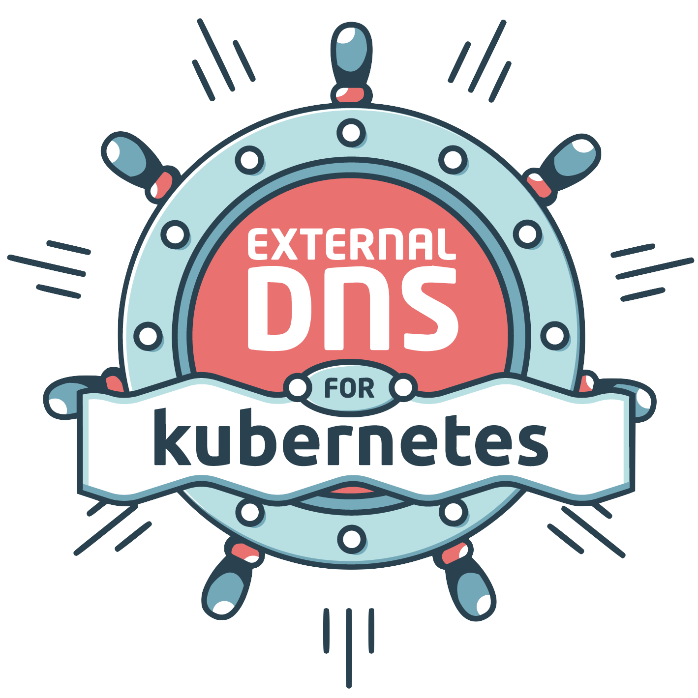
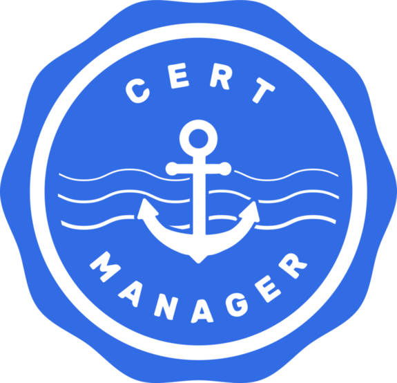

### AKS with ExternalDNS and CertManager
---

### Problem Statement

@ul[list-spaced-bullets text-09]
- How do we manage custom DNS entries for Ingress hostnames in Kubernetes
    - foo.example.com
    - bar.example.com
- For hosts that require an SSL certificate how can we manage certificates automcatically from Kubernetes

@ulend

---
<!--
@snap[north]
#### Ingress Code Block
@snapend
-->

@snap[north-east span-100 text-gray]
Live Code Presenting with Annotations
@snapend

```yaml
apiVersion: networking.k8s.io/v1beta1
kind: Ingress
metadata:
  name: nginx
  annotations:
    nginx.ingress.kubernetes.io/ingress.class: nginx
    cert-manager.io/cluster-issuer: letsencrypt
spec:
  tls:
  - hosts:
    - nginx.designingdevops.com
    secretName: tls-secret
  rules:
  - host: nginx.designingdevops.com
    http:
      paths:
      - backend:
          serviceName: nginx-svc
          servicePort: 80
        path: /
```
@[11,14]
---

@ul[list-spaced-bullets text-08]
### Barebones Overview
- Kubernetes orchestrates containers
- Namespace is a virtual space inside Kubernetes
- Pod is a set of containers working together
- A Service is a way to expose pods to the cluster or world
- Ingress is how traffic can get to the pods from outside the cluster
@ulend

---

### Four Distinct Networking Problems in Kubernetes
@ul[list-fade-fragments]
- Container-to-Container 
- Pod-to-Pod
- Pod-to-Service
- Internet-to-Service
@ulend

---

### Container-to-Container
@ul[list-spaced-bullets text-08]
- More than one container can be in a pod
- A pod is a group of containers that share a network namespace
- Containers in a pod all have the same IP and port space
- Containers can communicate over localhost
- Think of a pod as a host
@ulend

---

### Pod-to-Pod
@ul[list-spaced-bullets text-08]
- All Pods have an IP address
- All Pods use that IP address to communicate... even across nodes
- All Pods have their own network namespace (ip netns list) on the host
- Same host pods communicate over a local bridge on the host
- Routing Pod IPs to correct host is handled by container networking plugin
    - kubenet (default for AKS)
    - Azure Container Networking Interface (CNI)
@ulend
---

### Pod-to-Service
@ul[list-spaced-bullets text-08]
- Pod IPs are NOT durable
- Pod IPs will disappear and reappear in response to scaling, crashes or reboots
- @css[text-uppercase](Services) address this problem
    - Single IP representing a group of Pods
    - Pods can change over time and @css[text-uppercase](service) IP is persistent
    - Known as @css[text-blue](ClusterIP)
    - In cluster load balancer via iptables or IPV (IP Virtual Server)
    - @css[text-uppercase](Services) get internal DNS names (eg. my-svc.namespace.svc.cluster.local)
@ulend

---

### Internet-to-Service
@ul[list-spaced-bullets text-08]
- Egress
    - Pod IPs are SNAT'd to the VM's IP so that Load Balancer can route
- Ingress
    - When creating a Service can optionally create a @css[text-uppercase](LoadBalancer) type 
    - Implemention of Load Balancer is provide by cloud controller (Azure)
    - Load Balancer gets traffic to node where iptables takes over
    - Ingress Controller watches for Ingress resources and creates mappings to @css[text-uppercase](services)
    
@ulend
---

### Ingress Overview


---

### Ingress Overview


---

@snap[north span-50 text-center]
### ExternalDNS
@snapend

@snap[west span-65]
@ul[list-spaced-bullets text-07]
- Allows control of DNS records dynamically from Kubernetes
- Will create and delete records based on Kubernetes state
- Supports all major cloud providers but at various levels.  Azure is in Beta.
- Uses txt records for awareness of records it is managing 

@ulend
@snapend

@snap[east span-35]

@snapend

---
@snap[north]
### Setup ExternalDNS
@snapend

@snap[west]
@ul[list-spaced-bullets text-07]
1. Create an Azure DNS Zone
1. Set nameservers correctly at Registrar
1. Create Service Principal and assign Contributor to DNS Zone
1. Modify existing NGINX service to include --publish-service option
1. Deploy ExternalDNS
@ulend
@snapend

---
@snap[north text-center]
### CertManager
@snapend

@snap[west span-65]
@ul[list-spaced-bullets text-07]
- Automate the management and issuance of TLS certificates
- Ensures certificates are valid and attempts to renew
- Self-signed, CA, Vault, Venafi, External, @css[txt-bold](ACME) 
- Automatic Certificate Management Environment (ACME) (eg. Let's Encrypt)
    - HTTP
    - DNS
@ulend
@snapend

@snap[east span-35]

@snapend
---

### Setup CertManager
@ul[list-spaced-bullets text-08]
- Install NGINX if not already present
- Deploy CertManager to Kubernetes
- Create Issuer or ClusterIssuer objects 
    - Staging
    - Production
- Create Ingress object with reference to Issuer and host defined
@ulend
---    

# The END!
